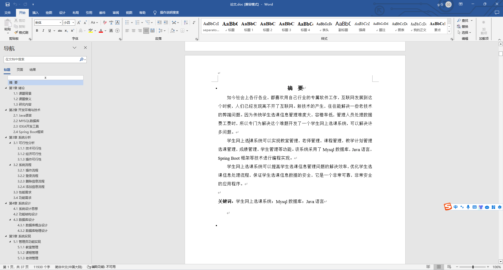
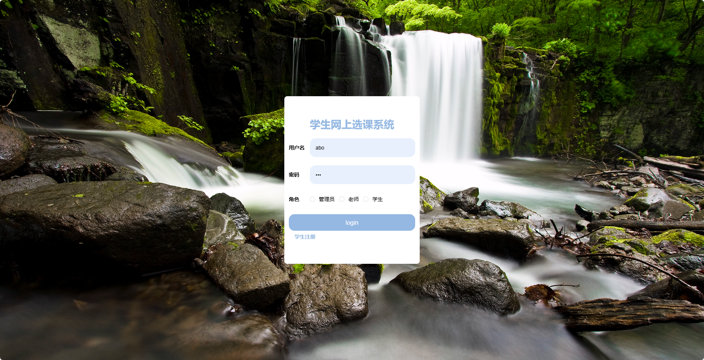
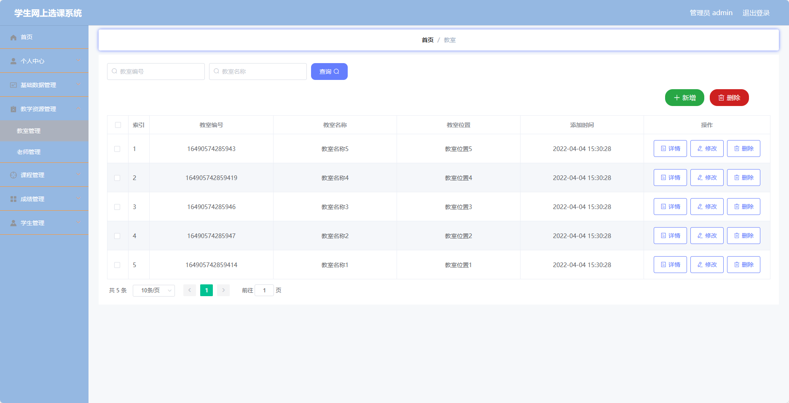
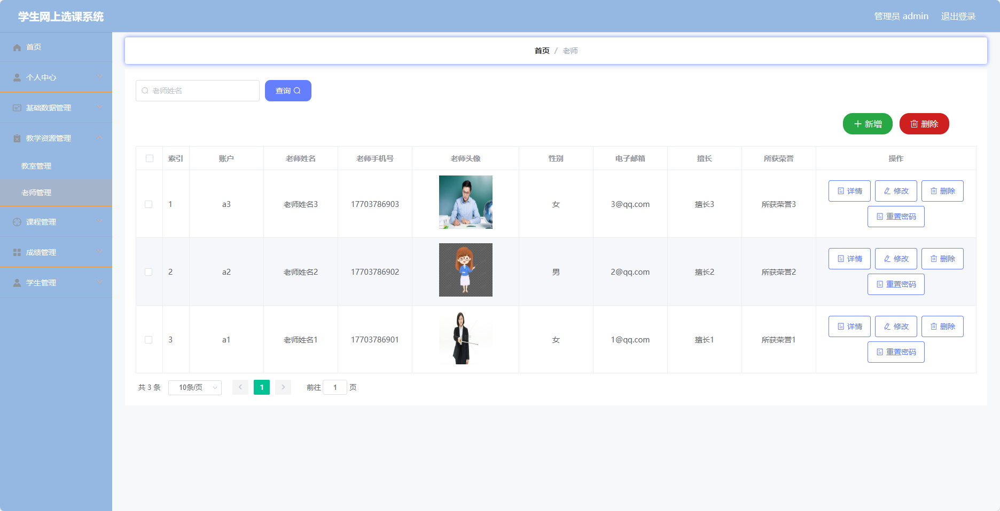
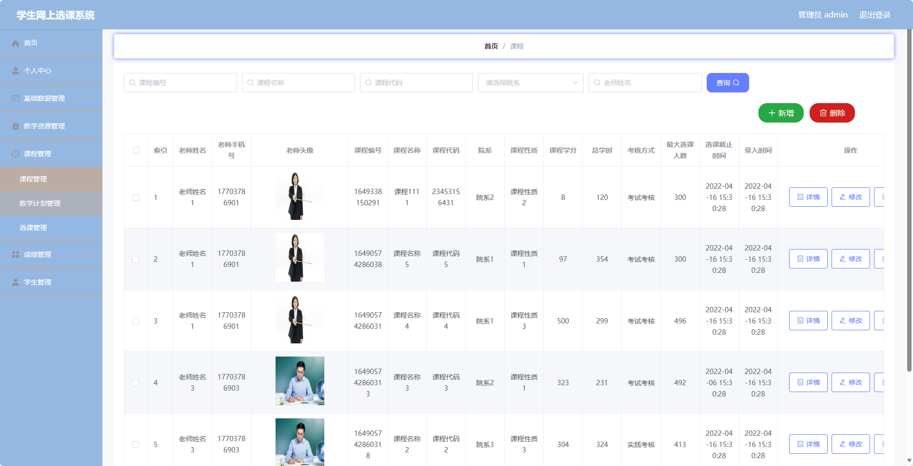
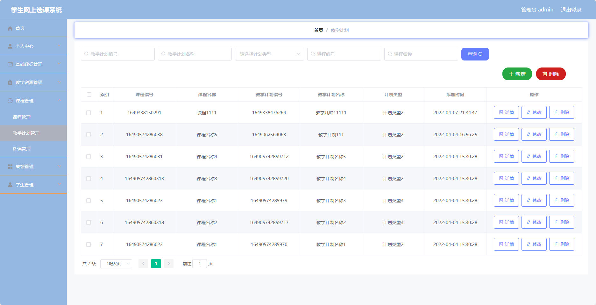
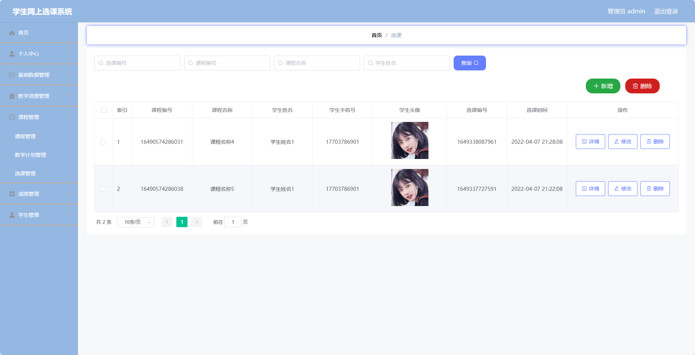
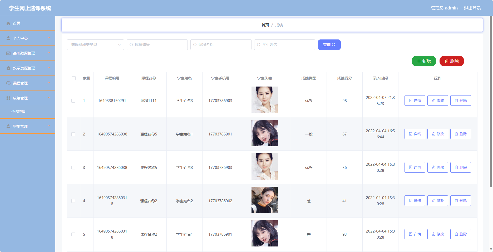
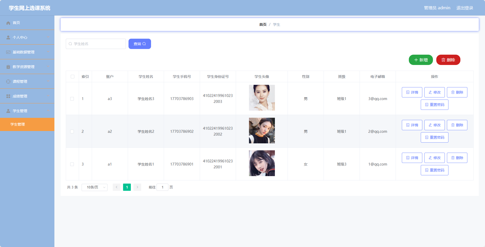
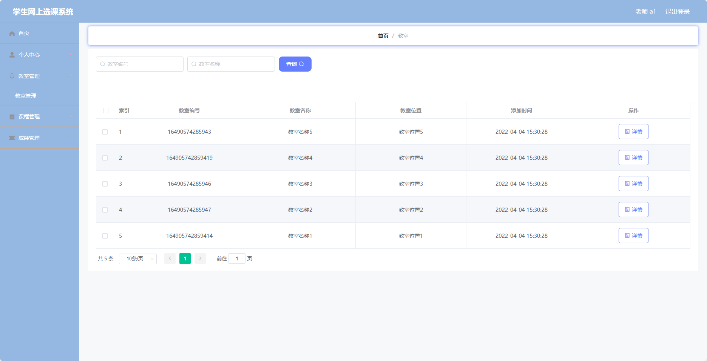

## 基于SpringBoot的学生网上选课系统(程序+报告)

###  获取sql数据库文件: 从戎源码网 (https://armycodes.com/) QQ: 386869957 QQ群: 377586148
###  所有系统地址: (https://github.com/YuLin-Coder/AllProjectCatalog) 
###  所有项目以及源代码本人均调试运行无问题 可支持远程安装部署调试、定制修改、代码讲解

## 项目介绍
基于SpringBoot的学生网上选课系统，系统包含三种角色：管理员、老师、学生,系统分为前台和后台两大模块，主要功能如下。

### 【管理员】:
- 个人中心：管理个人信息，包括修改个人信息、查看选课记录等。
- 基础数据管理：管理系统的基础数据，包括学院信息、专业信息、班级信息等。
- 教学资源管理：管理教学资源，包括上传、下载课件、资料等。
- 课程管理：管理课程信息，包括添加、编辑、删除课程等操作。
- 成绩管理：管理学生成绩，包括录入、修改、查询成绩等操作。
- 学生管理：管理学生信息，包括添加、编辑、删除学生等操作。

### 老师：
- 个人中心：管理个人信息，包括修改个人信息、查看选课记录等。
- 教室管理：管理教室信息，包括查看教室占用情况、修改教室信息等操作。
- 课程管理：管理课程信息，包括添加、编辑、删除课程等操作。
- 成绩管理：管理学生成绩，包括录入、修改、查询成绩等操作。

### 学生：
- 个人中心：管理个人信息，包括修改个人信息、查看选课记录等。
- 教室管理：管理教室信息，包括查看教室占用情况、选择合适的教室等操作。
- 课程管理：管理已选课程信息，包括退选课程、查询已选课程等操作。
- 成绩管理：查看自己的成绩信息。

## 项目技术
- 编程语言：Java
- 数据库：MySQL
- 项目管理工具：Maven
- 前端技术：HTML、CSS、JavaScript、Jquery、Vue
- 后端技术：Spring、SpringMVC、MyBatis

## 运行环境
- JDK版本：JDK1.8及以上
- 开发工具：IDEA、Ecplise、Myecplise都可以
- 数据库: MySQL5.7及以上
- Maven：maven3.0及以上
- Node：14.14.0及以上

## 运行截图

